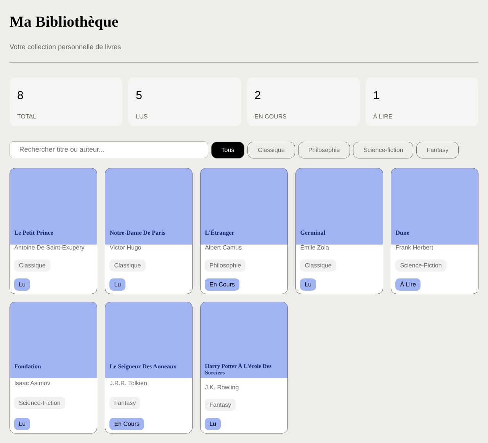
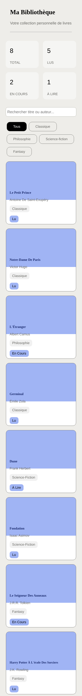

# 📚 Ma Bibliothèque

> Intégration responsive d'une page de gestion de bibliothèque personnelle, en **HTML**, **CSS** et **JavaScript** vanilla.


🌐 **[Voir la démo](https://aurored2-star.github.io/ma-bibliotheque/)**



---

## 📖 À propos

Projet réalisé lors d'une **ECF** (évaluation en cours de formation) de mon titre de **Développeuse Web et Web Mobile (DWWM)**.
L'objectif : reproduire une maquette de bibliothèque personnelle et la rendre **responsive** sur tous les écrans, du téléphone au grand écran.

## ✨ Fonctionnalités

- Tableau de bord avec le nombre de livres total, lus, en cours et à lire
- Barre de recherche et filtres par genre (Classique, Philosophie, Science-fiction, Fantasy)
- Grille de cartes « livre » avec titre, auteur, genre et statut de lecture
- Mise en page adaptée à **5 tailles d'écran**

## 📱 Responsive

| Fichier CSS | Écrans visés |
|---|---|
| `ecf xsmall.css` | Téléphones (jusqu'à 600 px) |
| `ecf small.css` | Grands téléphones et tablettes portrait (601 à 768 px) |
| `ecf.medium.css` | Tablettes paysage (769 à 992 px) |
| `ecf large.css` | Ordinateurs portables (993 à 1200 px) |
| `ecf xlarge.css` | Grands écrans (à partir de 1201 px) |

<p align="center">
  
</p>

## 🧠 Ce que j'ai travaillé

- Structure HTML sémantique (`header`, `main`, `aside`, `nav`, `section`, `article`)
- Mise en page avec **CSS Grid** et **Flexbox**
- **Media queries** pour l'adaptation aux différentes tailles d'écran
- Typographie avec Google Fonts (*Playfair Display*)
- Écoute d'événements JavaScript (`click`, `keydown`) sur les filtres et la recherche

## 🔧 Pistes d'amélioration

- [ ] Filtrer réellement les livres au clic sur un genre
- [ ] Rechercher en direct par titre ou auteur
- [ ] Générer les cartes depuis un tableau JavaScript plutôt qu'en HTML
- [ ] Calculer automatiquement les statistiques du tableau de bord

## 🚀 Lancer le projet

```bash
git clone https://github.com/aurored2-star/ma-bibliotheque.git
```

Ouvrez `index.html` dans votre navigateur, ou utilisez l'extension **Live Server** de VS Code.

## 👩‍💻 Autrice

**Aurore Dufour**, développeuse web & mobile en formation
[GitHub](https://github.com/aurored2-star)
